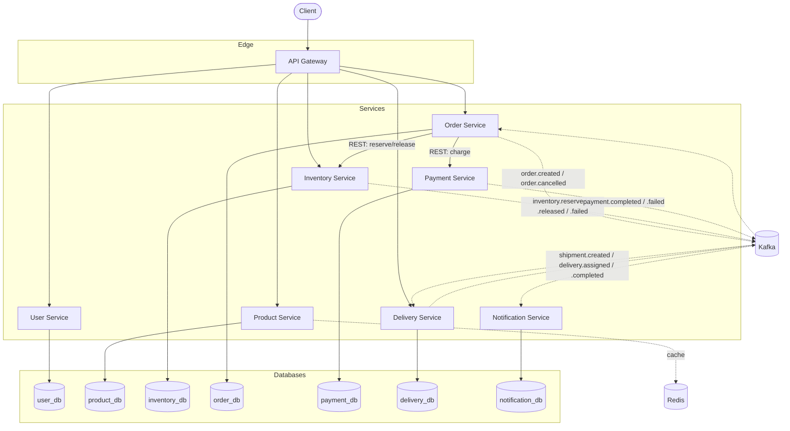

# Architecture

## Overview

The Smart Delivery Platform is a set of independently deployable Spring Boot services,
each owning its own PostgreSQL database, fronted by a single API Gateway. Services
communicate synchronously over REST for request/response needs (e.g. the gateway
routing a client call) and asynchronously over Kafka for business events that other
services need to react to (e.g. an order being created triggers inventory reservation).

Solid arrows are synchronous REST calls; dashed arrows are asynchronous Kafka events.

## Why microservices, and why these boundaries

Each service is scoped around a single business capability with a clear owner and a
clear data boundary (see [service-boundaries.md](service-boundaries.md)): identity,
catalog, stock, order orchestration, payment, delivery, and notification. The
boundaries were chosen so that:

- **Order Service never touches another service's database.** It reserves inventory
  and charges payment through their APIs (or reacts to their events), not SQL. This is
  what makes database-per-service actually enforceable — see
  [ADR 001](adr/001-database-per-service.md).
- **Kafka decouples the parts of the order workflow that don't need an immediate
  answer.** Once inventory is reserved and payment succeeds, shipment creation and
  notification delivery are "fire and react," not blocking calls — see
  [ADR 002](adr/002-kafka-for-events.md) and [saga.md](saga.md).
- **No shared domain module.** A shared library of DTOs/entities used by every service
  looks convenient early on and becomes the thing that makes every deploy a
  cross-team coordination problem. Event payloads and `EventEnvelope` stay duplicated
  per service for exactly that reason ([ADR 002](adr/002-kafka-for-events.md)); so do
  domain types, repositories, and each service's `SecurityFilterChain`.

  Phase 19 drew the line explicitly rather than leaving it to habit. There is now one
  shared module, `platform-starter`, and it holds **infrastructure only**: correlation
  ids, the error contract, resource-server wiring, the transactional outbox, and OpenAPI
  metadata — nearly 4,000 lines that had been copied service to service, and where
  divergence is a bug rather than a design choice. Nothing domain-shaped may go in it.
  [ADR 009](adr/009-platform-starter-and-the-shared-code-boundary.md) is the boundary,
  including what is deliberately left duplicated and why.

## Request flow: synchronous vs. asynchronous

- **Synchronous (REST, through the gateway or service-to-service):** used when the
  caller needs an answer before it can proceed — a customer fetching their order
  status, the Order Service asking Inventory to reserve stock before it can move the
  order forward.
- **Asynchronous (Kafka):** used when the producer doesn't need to block on the
  consumer, and when more than one consumer may care about the same fact — e.g.
  `PaymentCompleted` is consumed by both Order Service (to advance the saga) and
  Notification Service (to email the customer), and neither should be able to slow
  down or fail the other.

## Deployment topology (local development)

Every service, plus Postgres, Kafka (KRaft mode, no ZooKeeper), and Redis, runs in
Docker Compose on one bridge network (`smart-delivery-net`). There is no service
registry (Eureka/Consul): the gateway and inter-service calls use static Docker Compose
DNS names, overridable via environment variables. This is a deliberate simplification —
see [ADR discussion below](#deferred-decisions) — appropriate while every service runs
as exactly one instance.

Since Phase 20 there is also a Helm chart under `deploy/helm/`, and every service is ready
to run as more than one replica -- probes, graceful shutdown, container-aware JVM flags,
and connection budgets that add up across replicas. It has been rendered and validated
but **never applied to a cluster**, because there is no cluster to apply it to. See
[kubernetes.md](kubernetes.md).

## Deferred decisions

Documented here so they aren't silently forgotten:

- **Service discovery.** Static DNS via Docker Compose is sufficient for one instance
  per service, and there is deliberately no registry (Eureka or Consul). The route to
  multiple replicas is Kubernetes Services, which give DNS, load balancing and
  health-based endpoint removal with no registry to run -- and the Helm chart uses exactly
  that (Phase 20, [kubernetes.md](kubernetes.md)). Adding a registry there would mean
  operating a second discovery mechanism beside the one the platform already provides.
- **API Gateway authentication enforcement.** JWT validation at the edge vs. per-service
  is decided in [security.md](security.md) once the User Service issues tokens
  (Phase 2).
- **Prometheus/Grafana/OpenTelemetry.** Stood up in the observability phase (Phase 12),
  not before, so that there's something meaningful to observe.

## Build system

A single Maven multi-module reactor (`pom.xml` at the repository root) aggregates all
eight services for convenience (`mvn clean install` builds and tests everything in one
command, and CI does exactly that). This is a build-time convenience only, not a
runtime coupling — the parent POM contributes dependency and plugin **version**
management (`dependencyManagement`/`pluginManagement`), nothing else. Each module has
its own `pom.xml`, is independently packageable (`mvn -pl <service> -am package`), and
produces its own deployable JAR/Docker image with no dependency on any sibling module's
code.
