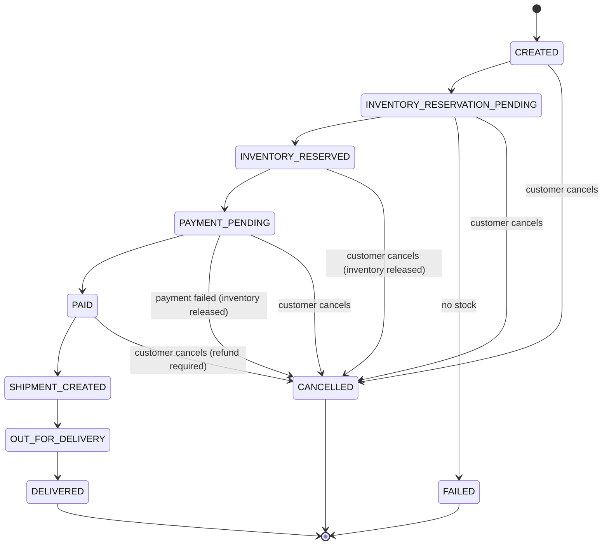
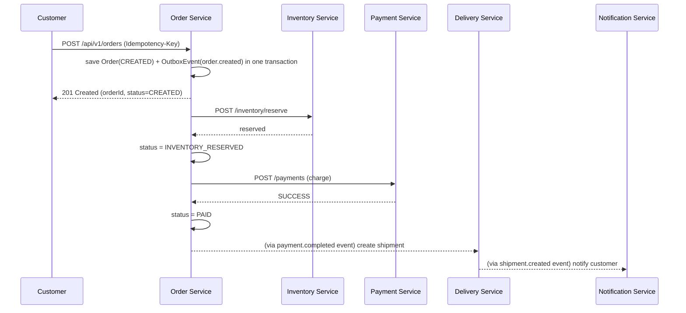

# Order Flow

> The state machine and REST APIs (this document's core) were implemented in Phase 5.
> The saga wiring that actually drives an order through `INVENTORY_RESERVATION_PENDING`
> → ... → `SHIPMENT_CREATED` is Kafka-event-driven and lands in Phases 6-7; until then,
> the states past `CREATED`/`CANCELLED` are reachable in the state machine (and
> enforced by [`OrderStatus`](../order-service/src/main/java/com/smartdelivery/order/domain/OrderStatus.java))
> but nothing yet drives an order into them.

## States

Cancellation is only allowed while the order has not yet shipped
(`CREATED` … `PAID`, before `SHIPMENT_CREATED`) — once a shipment exists, cancellation
must go through the delivery workflow instead of a simple status flip. Today
(Phase 5), `POST /api/v1/orders/{id}/cancel` only flips the order's own status; it does
not yet publish the event that would tell inventory-service to release a reservation or
payment-service to refund a charge for an order that had already progressed past
`CREATED` -- that compensation wiring is part of the saga (Phase 7, see
[saga.md](saga.md)). In practice this doesn't understate today's behavior: nothing yet
drives an order past `CREATED`, so every order that can be cancelled right now has
nothing to compensate.

## Happy path

The client gets a fast `201` as soon as the order row exists; reservation and payment
happen after the response is sent, and the client polls
`GET /api/v1/orders/{id}/status` (or later, receives a push notification) to see it
progress. This keeps `POST /orders` from blocking on two downstream services' latency
and failure modes.

## Failure and compensation

If inventory reservation fails (no stock): order goes straight to `FAILED`, no payment
is attempted, customer is notified.

If payment fails after inventory was reserved: the reservation must be released or the
warehouse silently loses sellable stock forever. See [saga.md](saga.md) for the full
compensation sequence — this is the concrete example that motivates the Saga pattern
for this service.

## Idempotency

`POST /api/v1/orders` accepts an optional `Idempotency-Key` header. A retried request
with the same key returns the original order instead of creating a duplicate —
required because the client may retry on a timeout without knowing whether the first
request's `201` was lost in transit.

Implementation: `orders` has a `UNIQUE (user_id, idempotency_key)` constraint. Before
creating anything, `OrderService` checks for an existing order with that key; if found,
it compares a SHA-256 fingerprint of the new request's meaningful content (shipping
address + line items, order-independent) against the one stored on the original order.
Same fingerprint → the original order is returned as-is (no re-pricing, no second call
to product-service). Different fingerprint → `409 IDEMPOTENCY_KEY_CONFLICT`, since
silently returning an unrelated order for a reused key would be worse than an error.
Two concurrent requests with the same brand-new key both fall through to `INSERT`; the
unique constraint lets exactly one succeed, and the loser re-reads and returns the
winner's row instead of surfacing the database error to its caller.
