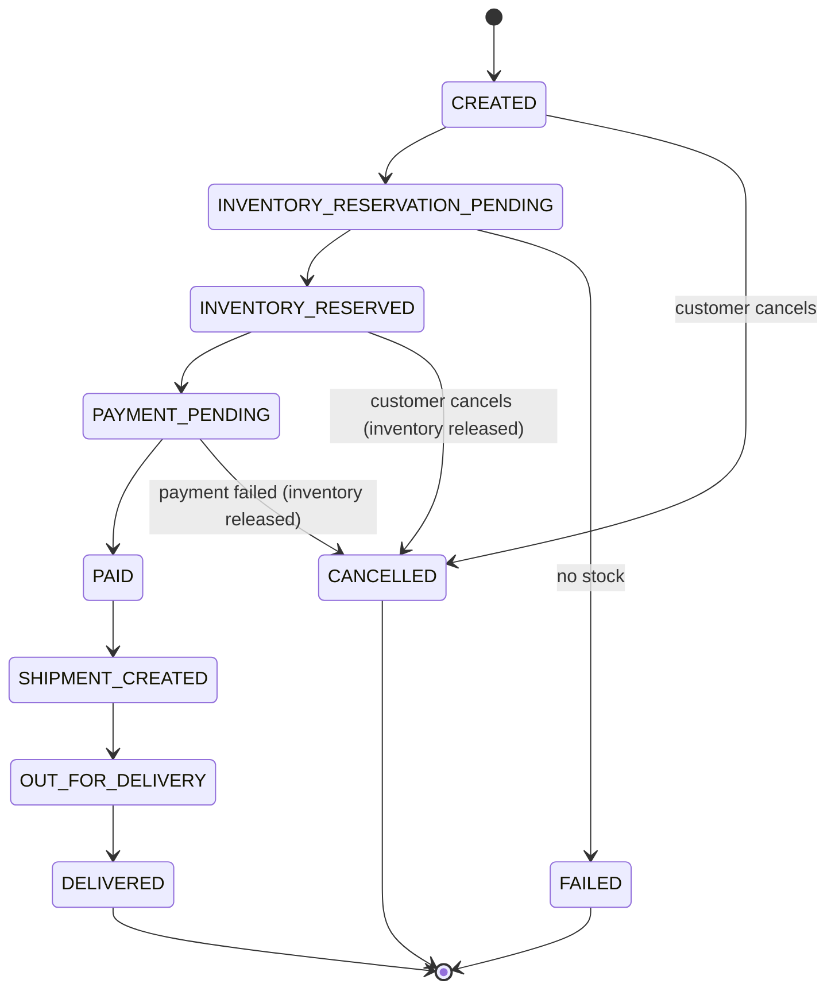
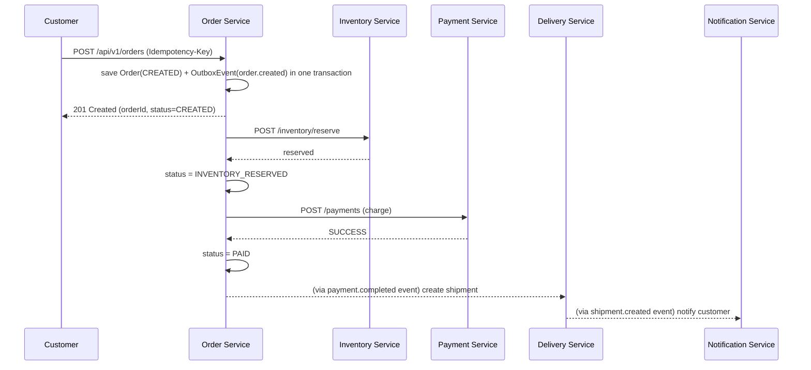

# Order Flow

> Implemented starting in Phase 5 (Order Service) and wired end-to-end in Phase 7
> (Saga). This document describes the target design so later phases have a fixed
> contract to build against.

## States

Cancellation is only allowed while the order has not yet shipped
(`CREATED` … `PAID`, before `SHIPMENT_CREATED`) — once a shipment exists, cancellation
must go through the delivery workflow instead of a simple status flip.

## Happy path

The client gets a fast `201` as soon as the order row exists; reservation and payment
happen after the response is sent, and the client polls
`GET /api/v1/orders/{id}/status` (or later, receives a push notification) to see it
progress. This keeps `POST /orders` from blocking on two downstream services' latency
and failure modes.

## Failure and compensation

If inventory reservation fails (no stock): order goes straight to `FAILED`, no payment
is attempted, customer is notified.

If payment fails after inventory was reserved: the reservation must be released or the
warehouse silently loses sellable stock forever. See [saga.md](saga.md) for the full
compensation sequence — this is the concrete example that motivates the Saga pattern
for this service.

## Idempotency

`POST /api/v1/orders` requires an `Idempotency-Key` header. A retried request with the
same key returns the original order instead of creating a duplicate — required because
the client may retry on a timeout without knowing whether the first request's `201`
was lost in transit. Design covered in [architecture.md](architecture.md) and detailed
once Order Service is implemented (Phase 5).
