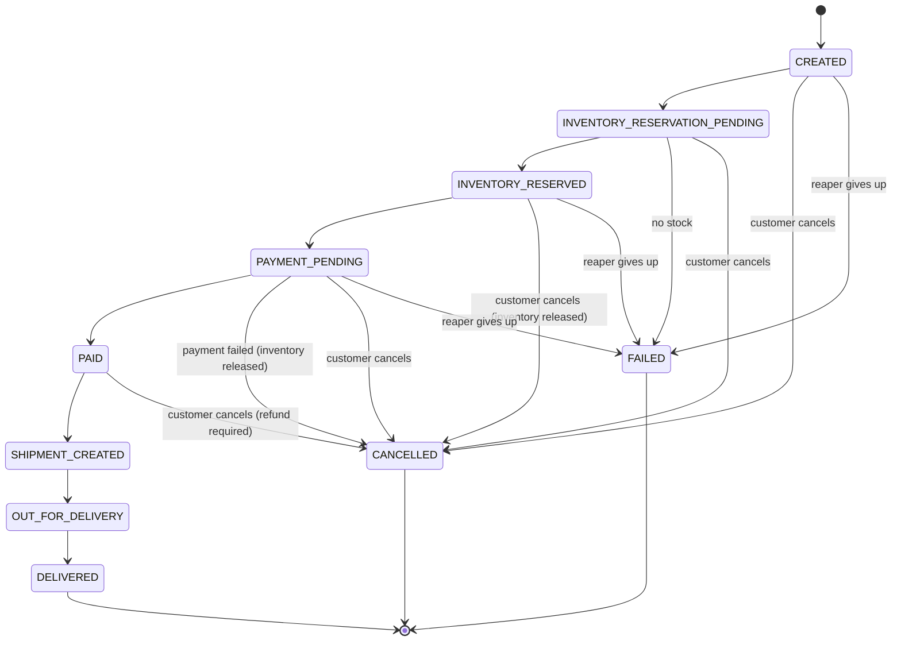
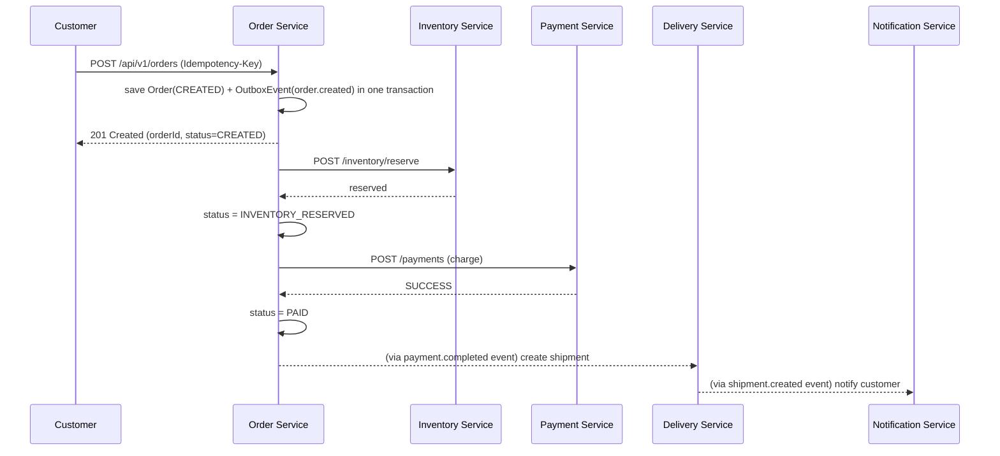

# Order Flow

> The state machine and REST APIs (this document's core) were implemented in Phase 5.
> The saga wiring that actually drives an order through `INVENTORY_RESERVATION_PENDING`
> → ... → `SHIPMENT_CREATED` is Kafka-event-driven and lands in Phases 6-7; until then,
> the states past `CREATED`/`CANCELLED` are reachable in the state machine (and
> enforced by [`OrderStatus`](../order-service/src/main/java/com/smartdelivery/order/domain/OrderStatus.java))
> but nothing yet drives an order into them.

## States

### The reaper's path (Phase 17)

The four states on the left below are the ones a saga can stall in. Nothing used to
notice: an order that has stopped progressing looks exactly like one progressing slowly.
`StuckSagaReaper` ([ADR 008](adr/008-reliable-compensation-and-stuck-saga-reaper.md)) is
what notices.

```mermaid
stateDiagram-v2
    state "CREATED / INVENTORY_RESERVATION_PENDING /\nINVENTORY_RESERVED / PAYMENT_PENDING" as STUCK
    [*] --> STUCK: saga step exhausted its Kafka retries
    STUCK --> CLAIMED: untouched for > saga.stuck-threshold\n(FOR UPDATE SKIP LOCKED; saga_attempts++)
    CLAIMED --> RESTARTED: saga_attempts < saga.max-attempts
    RESTARTED --> STUCK: still stuck a threshold later
    RESTARTED --> PAID: saga resumes and completes
    CLAIMED --> ABANDONED: attempts exhausted
    ABANDONED --> FAILED: release reservations, refund if charged,\nthen publish order.failed
    PAID --> [*]
    FAILED --> [*]
```

Incrementing `saga_attempts` refreshes `updated_at`, which takes the order out of the
eligible set for another `stuck-threshold`. That is what makes the claim a *lease*: a
second reaper instance polling at the same moment is skipped by `SKIP LOCKED`, and by its
next poll the order is no longer stuck.

Cancellation is only allowed while the order has not yet shipped
(`CREATED` … `PAID`, before `SHIPMENT_CREATED`) — once a shipment exists, cancellation
must go through the delivery workflow instead of a simple status flip.

`POST /api/v1/orders/{id}/cancel` flips the order's status and, in the *same transaction*,
writes an `order.cancelled` outbox row carrying the status the order held immediately
before. order-service then consumes that event itself and compensates off it — releasing a
reservation, or refunding a payment, depending on that previous status.

Compensation used to run inline in the cancel request, after that transaction had already
committed. A failed refund, or a pod dying in the window, left the order CANCELLED with
its stock still held and its payment still taken, and nothing anywhere would ever try
again. Moving it onto the event makes "the order was cancelled" and "something will
compensate for it" one atomic fact, and gives compensation the retry and dead-letter
handling every other consumer here already has. See
[ADR 008](adr/008-reliable-compensation-and-stuck-saga-reaper.md).

`FAILED` is reachable from every state a saga can stall in, not just from
`INVENTORY_RESERVATION_PENDING`. An abandoned saga has to be able to end somewhere;
before Phase 17 an order stalled in `INVENTORY_RESERVED` had no terminal state at all.

## Happy path

The client gets a fast `201` as soon as the order row exists; reservation and payment
happen after the response is sent, and the client polls
`GET /api/v1/orders/{id}/status` (or later, receives a push notification) to see it
progress. This keeps `POST /orders` from blocking on two downstream services' latency
and failure modes.

## Failure and compensation

If inventory reservation fails (no stock): order goes straight to `FAILED`, no payment
is attempted, customer is notified.

If payment fails after inventory was reserved: the reservation must be released or the
warehouse silently loses sellable stock forever. See [saga.md](saga.md) for the full
compensation sequence — this is the concrete example that motivates the Saga pattern
for this service.

## Idempotency

`POST /api/v1/orders` accepts an optional `Idempotency-Key` header. A retried request
with the same key returns the original order instead of creating a duplicate —
required because the client may retry on a timeout without knowing whether the first
request's `201` was lost in transit.

Implementation: `orders` has a `UNIQUE (user_id, idempotency_key)` constraint. Before
creating anything, `OrderService` checks for an existing order with that key; if found,
it compares a SHA-256 fingerprint of the new request's meaningful content (shipping
address + line items, order-independent) against the one stored on the original order.
Same fingerprint → the original order is returned as-is (no re-pricing, no second call
to product-service). Different fingerprint → `409 IDEMPOTENCY_KEY_CONFLICT`, since
silently returning an unrelated order for a reused key would be worse than an error.
Two concurrent requests with the same brand-new key both fall through to `INSERT`; the
unique constraint lets exactly one succeed, and the loser re-reads and returns the
winner's row instead of surfacing the database error to its caller.

**Until Phase 21 that last sentence was not true on PostgreSQL.** The re-read ran inside
the same transaction as the failed `INSERT`, and PostgreSQL aborts a transaction at its
first error -- so the re-read itself failed (`current transaction is aborted`) and the
loser got a `500`. It was the frontend's live walk-through that found it: a real
double-click sends two POSTs before the button can disable itself, which is exactly the
case the key exists for. `OrderService.create` now runs the attempt in an explicit
`TransactionTemplate` and does the re-read *after* it has rolled back; the winner has
committed by then, because the unique index made the loser's `INSERT` wait for it.
`ConcurrentIdempotentCreateIntegrationTest` forces the race with a barrier against real
PostgreSQL and was run against both versions: it fails on the old code with the same
error the walk-through logged, and passes on the new. Each recovered duplicate increments
`order_idempotency_concurrent_replays_total`. The frontend also stopped sending the
second request (a synchronous in-flight guard) -- but the server is the guarantee.
