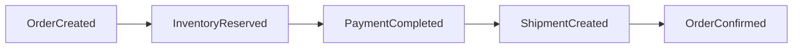
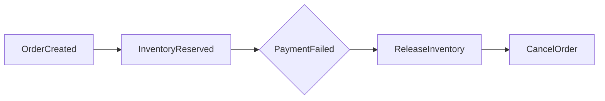

# Saga Pattern

> Implemented in Phase 7. This document fixes the design before that phase starts.

## Why a Saga instead of a distributed transaction

An order touches four services (Order, Inventory, Payment, Delivery), each with its
own database. A two-phase-commit distributed transaction across four independently
owned databases would mean every service blocks holding locks until the slowest
participant responds, and it would mean Order Service needs a coordinator role over
databases it does not own — which breaks the database-per-service boundary outright
(see [ADR 001](adr/001-database-per-service.md)). Instead, each step is a local ACID
transaction in its own service, and the workflow is stitched together with events plus
explicit compensating actions when a later step fails. This is an **orchestration-style**
Saga: Order Service is the orchestrator and holds the state machine
([order-flow.md](order-flow.md)); Inventory, Payment, and Delivery are participants that
know nothing about the saga itself, only about their own local transaction.

## Successful flow

## Compensating flow

Each forward step has a defined compensating action for every step that *could* have
already succeeded before it failed:

| Step that failed | What has already happened | Compensation |
|---|---|---|
| Inventory reservation fails | Nothing external yet | Order → `FAILED`. No compensation needed. |
| Payment fails | Inventory was reserved | Release the inventory reservation, then Order → `CANCELLED`. |
| Shipment creation fails | Inventory reserved + payment captured | Refund the payment, release inventory, Order → `FAILED`. (This is the deepest compensation chain — it's the reason shipment creation errors get the most aggressive retry/circuit-breaker treatment before compensation is triggered; see [Resilience, Phase 11].) |

Compensating actions are themselves idempotent — a reservation release or a refund can
be safely retried if the acknowledgement is lost, because both Inventory Service and
Payment Service treat "release/refund an already-released/refunded thing" as a no-op,
not an error.

## Orchestrator state

Order Service persists which saga step it's on as the `Order.status` column itself —
there's no separate "saga state" table distinct from the order's own lifecycle state.
Each inbound event (or REST response) is handled by a state transition function that:

1. Checks the order's current state (guards against handling an event twice, or out of
   order — see [Idempotency](#idempotency-and-duplicate-events) below).
2. Performs the next local transaction.
3. Writes the next state, publishing the next event via the transactional [outbox](#relationship-to-the-outbox-pattern).

## Idempotency and duplicate events

Kafka delivery is at-least-once (see [kafka-events.md](kafka-events.md)); every
consumer, including the saga step handlers in Order Service, must tolerate the same
event arriving twice. The guard is: before applying an event, check whether the order
is still in the state that event is a valid transition *from*. A duplicate
`PaymentCompleted` arriving after the order is already `PAID` is a no-op, not a second
charge or a duplicate shipment.

## Relationship to the outbox pattern

Every state transition that needs to notify another service does so by writing an
`OutboxEvent` row in the *same local transaction* as the state change, not by calling
`KafkaTemplate.send()` inline. See [ADR 004](adr/004-outbox-pattern.md) for why: without
this, "reserve inventory, then crash before publishing `InventoryReserved`" is possible
and leaves the saga stuck forever with no record that the reservation happened.
