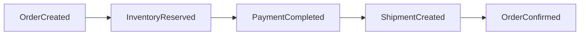
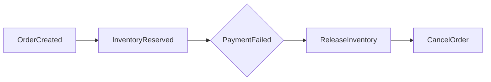

# Saga Pattern

> Order → Inventory → Payment, plus compensation, was implemented in Phase 7
> (`OrderSagaOrchestrator`). The Payment → Shipment leg is written and tested in
> isolation (order-service already consumes `shipment.created`/`delivery.assigned`/
> `delivery.completed`, since Phase 6) but nothing publishes those yet --
> delivery-service doesn't exist until Phase 9.

## Why a Saga instead of a distributed transaction

An order touches four services (Order, Inventory, Payment, Delivery), each with its
own database. A two-phase-commit distributed transaction across four independently
owned databases would mean every service blocks holding locks until the slowest
participant responds, and it would mean Order Service needs a coordinator role over
databases it does not own — which breaks the database-per-service boundary outright
(see [ADR 001](adr/001-database-per-service.md)). Instead, each step is a local ACID
transaction in its own service, and the workflow is stitched together with events plus
explicit compensating actions when a later step fails. This is an **orchestration-style**
Saga: Order Service is the orchestrator and holds the state machine
([order-flow.md](order-flow.md)); Inventory, Payment, and Delivery are participants that
know nothing about the saga itself, only about their own local transaction.

## How the saga actually starts

Order Service consumes its **own** `order.created` event (`OrderSagaStartListener`) to
kick `OrderSagaOrchestrator.startSaga` off, rather than running it inline inside the
`POST /api/v1/orders` request. This keeps order creation fast (the client gets its
`201` as soon as the row exists — see [order-flow.md](order-flow.md)) and means a
saga-start failure gets the same bounded retry + dead-letter handling every other
consumer here gets for free (`KafkaConsumerConfig`, Phase 6), instead of needing its
own bespoke retry logic.

## Successful flow

`InventoryReserved` and `PaymentCompleted` are real REST calls the orchestrator makes
today (to inventory-service and payment-service respectively), applied through the
same idempotent transition methods (`OrderSagaEventHandler`) the Phase 6 Kafka
consumer already uses — see [Two paths to the same transition](#two-paths-to-the-same-transition)
below. `ShipmentCreated` and `OrderConfirmed` are not reachable yet: nothing publishes
`shipment.created` until delivery-service exists (Phase 9).

## Compensating flow

Each forward step has a defined compensating action for every step that *could* have
already succeeded before it failed:

| Step that failed | What has already happened | Compensation |
|---|---|---|
| Inventory reservation fails for any line item | Any *other* line items in the same order may already be reserved | Release those (best-effort, logged if it fails), Order → `FAILED`. |
| Payment is declined | Inventory was reserved for every line item | Release every reservation, Order → `CANCELLED`. |
| Customer cancels while `PAID` | Inventory was already **deducted** (permanently committed, not just reserved — see below), payment was captured | Refund the payment. There is nothing to release: deduction, unlike reservation, isn't reversible by a plain release call. |
| Customer cancels before `PAID` | Inventory may be reserved | Release it (best-effort). |

Compensating actions are themselves idempotent — a reservation release or a refund can
be safely retried if the acknowledgement is lost, because both Inventory Service and
Payment Service treat "release/refund an already-released/refunded thing" as a no-op,
not an error. A compensation call that itself fails is logged, not retried inline or
allowed to abort the rest of the compensation loop — see `OrderSagaOrchestrator`'s
Javadoc for why a stuck reservation here is an accepted, flagged gap (needing a
reconciliation job, not built here) rather than something that should cascade into a
bigger failure.

## Deduct: converting a reservation into a permanent stock reduction

Once payment succeeds, the orchestrator calls inventory-service's `/deduct` endpoint
(built in Phase 4, unused until now) for every reserved line item, converting the
reservation into a permanent stock reduction. This is why a `PAID` order's
compensation (a later cancellation) is a refund, not a release: by then there is no
reservation left to release. A deduct failure after a successful payment is logged for
reconciliation, not treated as a reason to undo the payment (see
`OrderSagaOrchestrator.deductReservations`'s Javadoc for the reasoning).

## Two paths to the same transition

`OrderSagaOrchestrator` (the synchronous fast path, reacting to its own REST calls'
responses) and `OrderSagaEventHandler`'s Kafka consumers (the asynchronous backstop,
reacting to `inventory.reserved`/`payment.completed`/etc. published independently by
the downstream services) both ultimately call the exact same idempotent handler
methods to apply a transition. This redundancy is deliberate, not an oversight: if the
orchestrator crashes mid-saga after inventory-service has already reserved and
published its event, the Kafka consumer still picks that event up once order-service
restarts and advances the order anyway — no separate recovery mechanism needed. See
`OrderSagaOrchestrator`'s class Javadoc.

## Resumability

Every step the orchestrator takes is itself idempotent (reserve/release/deduct keyed
by `(orderId, productId)`; charge/refund keyed by `orderId`), which makes the *whole*
saga safely retryable, not just individual steps. If a step throws for an
infrastructure reason (not a clean business rejection — see
`InventoryServiceClient`/`PaymentServiceClient`), the exception propagates out of the
`@KafkaListener` and Spring Kafka retries the entire `startSaga` call. The retry simply
re-runs already-completed idempotent steps (they no-op) and picks back up from wherever
it actually left off — there's no separate checkpoint/resume bookkeeping to get wrong.

## Idempotency and duplicate events

Kafka delivery is at-least-once (see [kafka-events.md](kafka-events.md)); every
consumer, including the saga step handlers in Order Service, must tolerate the same
event arriving twice. The guard is: before applying an event, check whether the order
is still in the state that event is a valid transition *from*. A duplicate
`PaymentCompleted` arriving after the order is already `PAID` is a no-op, not a second
charge or a duplicate shipment.

## Relationship to the outbox pattern

**Using the outbox as of Phase 8.** `OrderEventPublisher`, `InventoryEventPublisher`,
and `PaymentEventPublisher` write an `OutboxEvent` row inside the same transaction as
the business change they announce (order creation/cancellation, a reservation/release,
a charge outcome), instead of calling `KafkaTemplate.send()` directly. A separate
`OutboxPublisher` polls and actually sends to Kafka. This closes the one real gap the
saga had: a crash between "the reservation committed" and "the event announcing it
reached Kafka" no longer loses that event silently -- the row survives the crash and
the next poll (or the next process's first poll, after restart) sends it. See
[ADR 004](adr/004-outbox-pattern.md) and
[kafka-events.md](kafka-events.md#the-outbox-in-practice) for the mechanics.

This doesn't change the saga's resumability story from
[above](#resumability) -- it strengthens it. Resumability already assumed a step's
*local* transaction was the unit of truth; the outbox just makes "the event announcing
that transaction" part of that same unit of truth, instead of a best-effort afterthought.

## Service-to-service authentication

The saga's REST calls (order-service → inventory-service, order-service →
payment-service) authenticate with a short-lived JWT `InternalServiceTokenProvider`
mints using the platform's shared HS256 secret — the same secret every service already
uses to validate user-issued tokens. This is a deliberate, documented stand-in for a
real service-to-service identity system (e.g. OAuth2 client-credentials against a
dedicated identity provider): genuinely functional, but it means any service holding
the shared secret could mint one. See [security.md](security.md).
