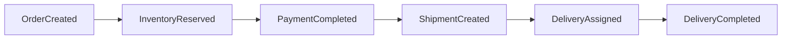
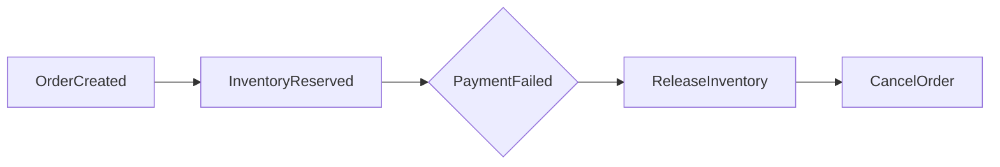

# Saga Pattern

> Order → Inventory → Payment → Shipment → Delivery is fully wired as of Phase 9.
> `OrderSagaOrchestrator` (Phase 7) drives Order → Inventory → Payment via direct REST
> calls; from Payment onward the saga continues purely through Kafka events
> delivery-service produces (Phase 9) and order-service has consumed since Phase 6 --
> see [Two paths to the same transition](#two-paths-to-the-same-transition) for why the
> switch from REST to events at that point is deliberate, not incidental.

## Why a Saga instead of a distributed transaction

An order touches four services (Order, Inventory, Payment, Delivery), each with its
own database. A two-phase-commit distributed transaction across four independently
owned databases would mean every service blocks holding locks until the slowest
participant responds, and it would mean Order Service needs a coordinator role over
databases it does not own — which breaks the database-per-service boundary outright
(see [ADR 001](adr/001-database-per-service.md)). Instead, each step is a local ACID
transaction in its own service, and the workflow is stitched together with events plus
explicit compensating actions when a later step fails. This is an **orchestration-style**
Saga: Order Service is the orchestrator and holds the state machine
([order-flow.md](order-flow.md)); Inventory, Payment, and Delivery are participants that
know nothing about the saga itself, only about their own local transaction.

## How the saga actually starts

Order Service consumes its **own** `order.created` event (`OrderSagaStartListener`) to
kick `OrderSagaOrchestrator.startSaga` off, rather than running it inline inside the
`POST /api/v1/orders` request. This keeps order creation fast (the client gets its
`201` as soon as the row exists — see [order-flow.md](order-flow.md)) and means a
saga-start failure gets the same bounded retry + dead-letter handling every other
consumer here gets for free (`KafkaConsumerConfig`, Phase 6), instead of needing its
own bespoke retry logic.

## Successful flow

`InventoryReserved` and `PaymentCompleted` are real REST calls the orchestrator makes
(to inventory-service and payment-service respectively), applied through the same
idempotent transition methods (`OrderSagaEventHandler`) the Phase 6 Kafka consumer
already uses. From `PaymentCompleted` onward, order-service isn't driving anymore --
delivery-service reacts to `payment.completed` on its own (`PaymentCompletedListener`)
to create a `Shipment`, publishes `ShipmentCreated`; an admin assigning a
`DeliveryAgent` publishes `DeliveryAssigned`; that agent completing it publishes
`DeliveryCompleted`. order-service just consumes all three, the same way it's consumed
every other event in this saga since Phase 6 -- see
[Two paths to the same transition](#two-paths-to-the-same-transition) below for why
the first half is REST-driven and the second half is purely event-driven, on purpose.

## Compensating flow

Each forward step has a defined compensating action for every step that *could* have
already succeeded before it failed:

| Step that failed | What has already happened | Compensation |
|---|---|---|
| Inventory reservation fails for any line item | Any *other* line items in the same order may already be reserved | Release those (best-effort, logged if it fails), Order → `FAILED`. |
| Payment is declined | Inventory was reserved for every line item | Release every reservation, Order → `CANCELLED`. |
| Customer cancels while `PAID` | Inventory was already **deducted** (permanently committed, not just reserved — see below), payment was captured | Refund the payment. There is nothing to release: deduction, unlike reservation, isn't reversible by a plain release call. |
| Customer cancels before `PAID` | Inventory may be reserved | Release it (best-effort). |

Compensating actions are themselves idempotent — a reservation release or a refund can
be safely retried if the acknowledgement is lost, because both Inventory Service and
Payment Service treat "release/refund an already-released/refunded thing" as a no-op,
not an error. (Tested where the guarantee lives: `InventoryApiIntegrationTest` for
release, `PaymentServiceTest` for refund.)

### Cancellation compensation is driven by the event, not the request (Phase 17)

Until Phase 17, `OrderController.cancel` compensated inline: `OrderService.cancel`
committed the CANCELLED status, and the controller then called the orchestrator on the
same request thread, outside that transaction, with every exception caught and logged.
A refund that failed, or a pod that died in that window, left an order CANCELLED with its
stock still reserved and its payment still taken — and nothing anywhere that would ever
look at it again.

Now `OrderService.cancel` writes the `order.cancelled` outbox row in the same transaction
as the cancellation (it already did) with a new `previousStatus` field, and
`OrderCancellationListener` — order-service consuming its own event, in its own consumer
group — compensates off it. Two things follow:

- **"Cancelled" and "will be compensated for" are one atomic fact.** Nothing can commit
  one without the other.
- **Compensation failures now throw rather than being logged.** On an HTTP thread there
  was nothing to retry, so logging was all there was; on a listener, throwing is what
  reaches the bounded retry and dead-letter handling every other consumer here already
  has. Every line is attempted before anything is raised, so a retry has as little left to
  do as possible.

`previousStatus` has to travel on the event because nothing else carries it: by the time a
consumer reads the order back it is already CANCELLED, which does not say whether there is
a reservation to release or a payment to refund. See
[ADR 008](adr/008-reliable-compensation-and-stuck-saga-reaper.md).

## Deduct: converting a reservation into a permanent stock reduction

Once payment succeeds, the orchestrator calls inventory-service's `/deduct` endpoint
(built in Phase 4, unused until now) for every reserved line item, converting the
reservation into a permanent stock reduction. This is why a `PAID` order's
compensation (a later cancellation) is a refund, not a release: by then there is no
reservation left to release. A deduct failure after a successful payment is logged for
reconciliation, not treated as a reason to undo the payment (see
`OrderSagaOrchestrator.deductReservations`'s Javadoc for the reasoning).

## Two paths to the same transition

`OrderSagaOrchestrator` (the synchronous fast path, reacting to its own REST calls'
responses) and `OrderSagaEventHandler`'s Kafka consumers (the asynchronous backstop,
reacting to `inventory.reserved`/`payment.completed`/etc. published independently by
the downstream services) both ultimately call the exact same idempotent handler
methods to apply a transition. This redundancy is deliberate, not an oversight: if the
orchestrator crashes mid-saga after inventory-service has already reserved and
published its event, the Kafka consumer still picks that event up once order-service
restarts and advances the order anyway — no separate recovery mechanism needed. See
`OrderSagaOrchestrator`'s class Javadoc.

This is also why the saga is REST for Order → Inventory → Payment but purely
event-driven from Payment → Shipment → Delivery onward: order-service *is* the
orchestrator for the first three steps, so it needs an immediate REST result to decide
whether to proceed or compensate (see
[service-boundaries.md](service-boundaries.md#communication-matrix)). Shipment and
Delivery are not orchestrated at all — delivery-service reacts to `payment.completed`
and to admin/agent actions entirely on its own, and order-service is just one more
consumer of the facts it announces, the same relationship notification-service (Phase
10) has to every topic in the catalog. There's nothing for order-service to orchestrate
there because nothing needs an immediate yes/no back from it.

## Resumability

Every step the orchestrator takes is itself idempotent (reserve/release/deduct keyed
by `(orderId, productId)`; charge/refund keyed by `orderId`), which makes the *whole*
saga safely retryable, not just individual steps. If a step throws for an
infrastructure reason (not a clean business rejection — see
`InventoryServiceClient`/`PaymentServiceClient`), the exception propagates out of the
`@KafkaListener` and Spring Kafka retries the entire `startSaga` call. The retry simply
re-runs already-completed idempotent steps (they no-op) and picks back up from wherever
it actually left off — there's no separate checkpoint/resume bookkeeping to get wrong.

### …but something has to do the resuming (Phase 17)

Resumability is a property of the *design*; it only helps if something actually re-drives
the saga. Until Phase 17 nothing did. Spring Kafka's three retries are exhausted in a few
seconds; after that the message is dead-lettered and the order is left in whichever state
it reached — CREATED, INVENTORY_RESERVATION_PENDING, INVENTORY_RESERVED or PAYMENT_PENDING
— holding reservations forever. Nothing noticed, and nothing could: an order that has
stopped progressing looks exactly like one progressing slowly.

`StuckSagaReaper` is what re-drives it. Every `saga.reaper-interval-ms` it claims orders
in a resumable state that nothing has touched for longer than `saga.stuck-threshold`
(default 5m) and either:

- **re-runs `startSaga`**, if the order is under `saga.max-attempts` (default 3) — which
  is exactly the resumability above, finally being exercised; or
- **gives up**: release every reservation, refund if anything was charged, mark the order
  FAILED through the state machine, and publish `order.failed` through the outbox. An
  order that cannot be completed and is never released is worse than one honestly failed.

The claim is `FOR UPDATE SKIP LOCKED`, the same mechanism the outbox poller uses
([ADR 006](adr/006-outbox-concurrency-and-ordering.md)), and it doubles as a lease:
incrementing `saga_attempts` refreshes `updated_at`, so a claimed order leaves the
eligible set until the threshold passes again. Two reaper instances therefore never work
the same order. See [order-flow.md](order-flow.md#the-reapers-path-phase-17) for the state
diagram and [ADR 008](adr/008-reliable-compensation-and-stuck-saga-reaper.md) for the
design.

## Idempotency and duplicate events

Kafka delivery is at-least-once (see [kafka-events.md](kafka-events.md)); every
consumer, including the saga step handlers in Order Service, must tolerate the same
event arriving twice. The guard is: before applying an event, check whether the order
is still in the state that event is a valid transition *from*. A duplicate
`PaymentCompleted` arriving after the order is already `PAID` is a no-op, not a second
charge or a duplicate shipment.

## Relationship to the outbox pattern

**Using the outbox everywhere.** `OrderEventPublisher`, `InventoryEventPublisher`, and
`PaymentEventPublisher` write an `OutboxEvent` row inside the same transaction as the
business change they announce (order creation/cancellation, a reservation/release, a
charge outcome), instead of calling `KafkaTemplate.send()` directly -- since Phase 8.
`DeliveryEventPublisher` does the same since Phase 9, when it was written. A separate
`OutboxPublisher` per service polls and actually sends to Kafka. This closes the one
real gap the saga had: a crash between "the reservation committed" (or the shipment
created, or the delivery assigned) and "the event announcing it reached Kafka" no
longer loses that event silently -- the row survives the crash and the next poll (or
the next process's first poll, after restart) sends it. See
[ADR 004](adr/004-outbox-pattern.md) and
[kafka-events.md](kafka-events.md#the-outbox-in-practice) for the mechanics.

This doesn't change the saga's resumability story from
[above](#resumability) -- it strengthens it. Resumability already assumed a step's
*local* transaction was the unit of truth; the outbox just makes "the event announcing
that transaction" part of that same unit of truth, instead of a best-effort afterthought.

## Service-to-service authentication

The saga's REST calls (order-service → inventory-service, order-service →
payment-service) carry a short-lived `SERVICE`-role token that order-service obtains from
user-service by presenting its own client id and secret — a real client-credentials grant
as of Phase 16 ([ADR 007](adr/007-asymmetric-jwt-signing.md)).

Until then, order-service *minted* those tokens itself with the platform-wide HMAC
secret. That was genuinely functional and genuinely weak: it worked only because every
service held the same key, which meant every service could have minted one — including an
ADMIN token. Now order-service holds no signing key, and inventory-service and
payment-service can verify a `SERVICE` token but could never produce one. See
[security.md](security.md).

`ServiceTokenProvider` caches the token and refreshes it ahead of expiry, so this adds a
network call per few minutes rather than per saga step. A fetch that cannot succeed raises
`ServiceTokenUnavailableException`, which propagates into the same Kafka retry and
dead-letter path as any other infrastructure failure in a saga step — the saga's
resumability story is unchanged.
