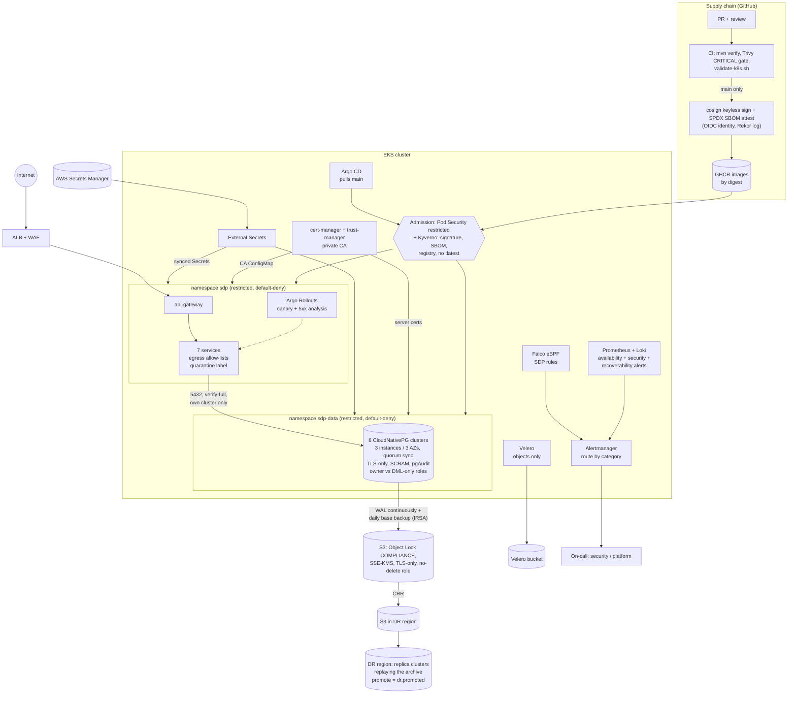

# Security hardening and resilience (Phase 22)

This guide covers how the platform is defended and recovered in production, and where
each control lives in the repository. The decision and its alternatives are in
[ADR 014](adr/014-production-security-and-resilience.md). The procedures are in the
[incident-response](runbooks/incident-response.md) and
[disaster-recovery](runbooks/disaster-recovery.md) runbooks. Application-level security
(JWT, roles, ownership checks, errors) is in [security.md](security.md) and is unchanged.

Target environment: **EKS**. The ideas carry over to any Kubernetes; the AWS-specific
parts are IRSA, Secrets Manager, S3 and KMS.

## Architecture

## 1. Kubernetes hardening

| Control | Why | Where |
|---|---|---|
| **Pod Security `restricted`** on `sdp` and `sdp-data`, enforced, audited, warned, and pinned to a version | The chart already runs non-root with a read-only root filesystem, no capabilities and RuntimeDefault seccomp. Enforcement turns that convention into a guarantee, and nothing can be deployed that undoes it. | `deploy/cluster/00-namespaces.yaml` |
| **Default-deny, both directions**, then per-service allow-lists | Without egress rules, a compromised pod can reach every database, the internet, and the node's IMDS credentials. Each service now reaches DNS, its own Postgres cluster, its Kafka and Redis peers, and OTLP, and nothing else. | `templates/networkpolicy.yaml`, `networkPolicy.*` in `values-production.yaml` |
| **Quarantine label** | Policies are additive, so a deny cannot override an allow. Instead, every allow policy excludes `security.sdp/quarantine`. Labelling a pod cuts all its traffic, including to its database, and keeps it for forensics. CI fails if a new policy forgets the exclusion. | same, plus `scripts/validate-k8s.sh` |
| **RBAC** | Developers get `view`: no Secrets, no exec. On-call gets exactly the incident verbs (label, scale, rollout, NetworkPolicy). Break-glass is `cluster-admin` for a group with no standing members, reached through an MFA-gated IAM role. | `deploy/cluster/rbac/` |
| **Secrets from AWS Secrets Manager** via ESO and IRSA | This gives a source of truth outside etcd, with its own access log, rotation and IAM. The ClusterSecretStore is usable only from `sdp` and `sdp-data`. Chart and cluster never hold a value, and the same SM key feeds the app Secret and the DB role, so a rotation is one write. | `templates/externalsecrets.yaml`, `deploy/cluster/external-secrets/`, `deploy/helm/sdp-data/templates/externalsecrets.yaml` |
| **Image scanning** | Trivy fails the build on any CRITICAL, fixed or not. The base image is Alpine, and runtime images are JRE-only. | `.github/workflows/ci.yml` |
| **Signing and SBOM** | Keyless cosign on the pushed digest plus a signed SPDX attestation, so there is no key to steal. Kyverno admits only images signed by `ci.yml@refs/heads/main` that carry an SBOM, and pins pods to the verified digest. | `ci.yml`, `deploy/cluster/kyverno/verify-image-signatures.yaml` |
| **Admission policies** | Registry allow-list per namespace, no `:latest` or untagged images, and requests and memory limits (Audit, then Enforce). Each is tested in CI against the production render, positively and negatively. | `deploy/cluster/kyverno/` |
| **Runtime detection** | Falco (modern eBPF) with SDP rules: the JVM spawning a shell or network tool (RCE), a non-JVM process reading the service-account token, package managers, mining ports, interactive shells. Alerts go through falcosidekick to Alertmanager and Loki. | `deploy/cluster/falco/values.yaml` |

## 2. PostgreSQL security

| Control | Why | Where |
|---|---|---|
| **One cluster per service** | ADR 001's boundary, enforced three ways: in code, in the network (port 5432 admits one client service), and in Postgres. It also contains noisy neighbours, restores and credential blast radius. | `deploy/helm/sdp-data` |
| **TLS 1.3 only, verified** | `pg_hba` rejects non-TLS before anything else can match. The services connect with `sslmode=verify-full`, so a spoofed endpoint never receives a password. The server certificate comes from a private CA through cert-manager, with 90-day ECDSA keys rotated on renewal and reloaded live. trust-manager distributes the CA. | `sdp-data/templates/certificate.yaml`, `deploy/cluster/cert-manager/`, `database.tls` in the app chart |
| **SCRAM-SHA-256**, no superuser password | Break-glass is `kubectl cnpg psql`, which is RBAC-gated and fully audited. | `sdp-data/values.yaml` |
| **Owner / runtime role split** | Flyway runs as `<svc>_owner`, which owns every object. The pool runs as `<svc>_app`: DML only, through `<db>_rw` and default privileges. An injection can read and write that service's rows, but cannot DROP or TRUNCATE, and cannot touch another service's data. Tested against real migrations and traffic. | `sdp-data/templates/cluster.yaml`, `spring.flyway.user/password` in each `application.yml` |
| **pgAudit** | All DDL and role changes by anyone, and every statement by the superuser. Parameters are not logged, because that's where the PII is. A Loki rule pages on DDL by any non-owner role. | `sdp-data/values.yaml`, `deploy/cluster/observability/loki-rules.yaml` |
| **Credential theft** | Credentials are short-lived in practice: rotated in SM, applied by CNPG, and picked up by restart. Connection limits apply per role. Password-guessing and `pg_hba` rejection alerts come from the logs. | runbook: rotating a database password |
| **Encryption at rest** | The encrypted StorageClass (EBS + KMS) for data and WAL, and SSE-KMS for every backup object. | `cluster.storage.storageClass`, `backup.encryption` |

## 3. Detection and response

**Alerts carry a `category` label**, and Alertmanager routes on it: `security` to the
security on-call, `recoverability` to platform. The sources are:
- **Prometheus, security:** `SdpAuthFailureSpike`, `SdpForbiddenSpike`,
  `SdpBusyWithoutTraffic`, `SdpConcurrentOrderReplays`.
- **Falco:** the runtime rules above.
- **Loki:** Postgres authentication failures, `pg_hba` rejections, unexpected DDL.

**Response** follows [the incident runbook](runbooks/incident-response.md): detect,
triage, contain (quarantine label, orphan from the ReplicaSet, capture evidence), then
eradicate. Eradication covers credential rotation for the database, the JWT key and the
service client; tracing the entry point via the SBOM and the signature; and fixing
through CI. Then recover and review.

## 4. Rollback and recovery

| Layer | Mechanism | Where |
|---|---|---|
| Release | Argo Rollouts canary for order-service (25/50/75%), which aborts automatically on the canary pods' 5xx ratio. Everything else: `git revert` plus an Argo CD sync. Migrations are expand/contract, so code rollback never needs a schema rollback. | `templates/rollouts.yaml`, [DR runbook](runbooks/disaster-recovery.md#bad-deploy) |
| Database | Continuous WAL archiving plus daily base backups (from a standby, staggered) through the Barman Cloud plugin. PITR is declared in git (`recoverFrom`, into a new cluster, then switch). | `sdp-data/templates/{cluster,objectstore,scheduledbackup}.yaml` |
| Backups themselves | S3 Object Lock in COMPLIANCE mode, SSE-KMS, TLS-only, and a backup role with no `DeleteObject`, so ransomware with our admin credentials still cannot delete them. Replicated cross-region. | `deploy/cluster/backup-bucket/create-backup-bucket.sh` |
| Kubernetes objects | Git plus Argo CD first. Velero daily for the state as it was, without Secrets (ESO re-syncs them) and without DB volumes (CNPG owns those). | `deploy/cluster/velero/` |

## 5. Monitoring and alerting

The Phase 13–20 dashboards and availability alerts are unchanged. Phase 22 adds:
- **Security alerts**, as above.
- **Recoverability alerts:**
  - WAL archiving failing or stale;
  - backup stale, or its metric absent, so a wrong metric name is loud;
  - no synchronous standby, which means writes are blocked.
- **Capacity alerts:** connections, volumes, XID age.
- **Routing by category.**

Every rule is parsed in CI: `promtool` for Prometheus, `lokitool` for Loki.

## 6. High availability and disaster recovery

| Failure | RPO | RTO | How |
|---|---|---|---|
| Pod or node | 0 | < 1 min | Replicas, PDBs, and CNPG failover to the sync standby |
| Availability zone | 0 | < 1 min | Zone-spread pods; DB instances pinned one per AZ; quorum sync means a standby in another AZ has every commit |
| Bad release | 0 | minutes | Canary abort, revert |
| Logical corruption | seconds before the event | 30–60 min | PITR |
| Region | ≤ 5 min + S3 CRR (< 15 min) | < 1 h | Promote the DR region's replica clusters (`dr.promoted`), sync the app, switch DNS |

These are targets until measured. The quarterly restore drill in the DR runbook turns
them into numbers.

## Priorities

Apply them in this order. Each tier assumes the one before it.

**P0: before any production traffic**
1. Secrets out of the repo and out of hand-made Secrets: ESO plus Secrets Manager.
2. Database TLS with `verify-full`, SCRAM, and no superuser password.
3. Continuous WAL archiving and base backups, **plus one completed restore drill**.
4. Pod Security `restricted`, and RBAC without standing admin.
5. The CI CRITICAL-CVE gate (Trivy).

**P1: first month**
1. Default-deny network policies with egress allow-lists, and the quarantine label.
2. The owner/runtime role split, and pgAudit.
3. Image signing plus Kyverno verification; the registry and tag policies.
4. Security and recoverability alerts, routed.
5. Object Lock on the backup bucket.

**P2: first quarter**
1. Falco with the SDP rules, tuned in staging with the event generator.
2. The DR region replica, and the first region failover drill.
3. Canary releases, beyond order-service.
4. Velero, Loki detection rules, and the Kyverno requests/limits policy moved from Audit
   to Enforce.

**Later / out of scope**
- A service mesh for pod-to-pod mTLS (ADR 014 says why not yet).
- Login rate limiting and lockout in user-service.
- Refresh tokens and revocation ([security.md](security.md)).
- WAF rule tuning.
- A pre-deploy migration Job, which would take migrator credentials out of the pods.

## Checklist

**Supply chain**
- [ ] CI green on `main`, including the `k8s-manifests` job.
- [ ] `cosign verify` succeeds for the deployed digest (command in [ci-cd.md](ci-cd.md#published-images)).
- [ ] Kyverno policies applied; a test deploy of an unsigned image is refused.

**Cluster**
- [ ] Namespaces labelled (`kubectl get ns --show-labels`); a privileged test pod is refused in `sdp`.
- [ ] No human in a `cluster-admin` binding except via `sdp:break-glass`.
- [ ] The ESO ClusterSecretStore is `Ready`, and every ExternalSecret is `SecretSynced`.
- [ ] The trust-manager Bundle has written `sdp-postgres-ca` into `sdp`.
- [ ] Falco is running on every node; `falcosecurity/event-generator` triggers the SDP rules in staging.

**Network**
- [ ] `networkPolicy.restrictEgress` and `defaultDenyNamespace` are on, and the REPLACE_ME peers are filled in.
- [ ] From a service pod: its own DB, Kafka and Redis connect; another service's DB and the internet time out; `169.254.169.254` times out.
- [ ] A quarantined test pod has no traffic in either direction.

**Database**
- [ ] All six clusters are healthy, three instances across three zones, with one sync standby.
- [ ] `psql "sslmode=disable"` is rejected; `sslmode=verify-full` with the CA succeeds.
- [ ] The app role cannot `CREATE TABLE` or `DROP`.
- [ ] pgAudit lines appear in Loki for a test DDL.
- [ ] A base backup exists for each cluster, and WAL archiving is current.
- [ ] **A restore drill has been completed and recorded.**
- [ ] The bucket has Object Lock (`aws s3api get-object-lock-configuration`), and deleting an object version fails.

**Detection and response**
- [ ] Alertmanager routes a synthetic `category=security` alert to the security on-call.
- [ ] The incident and DR runbooks have been walked through once by someone who didn't write them.

**Release**
- [ ] An order-service canary with an injected 5xx rate aborts by itself in staging.
